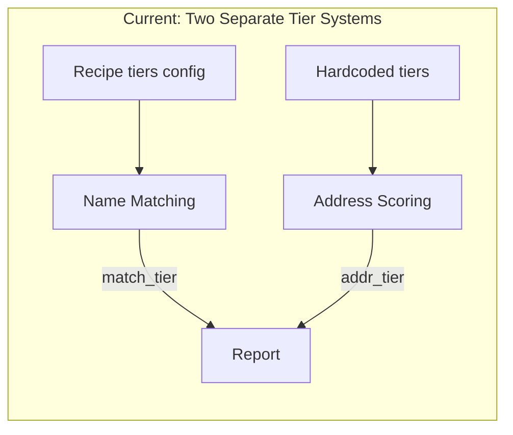
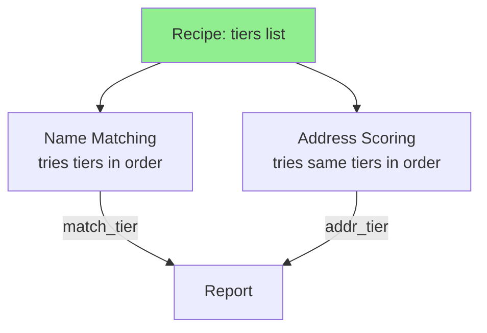
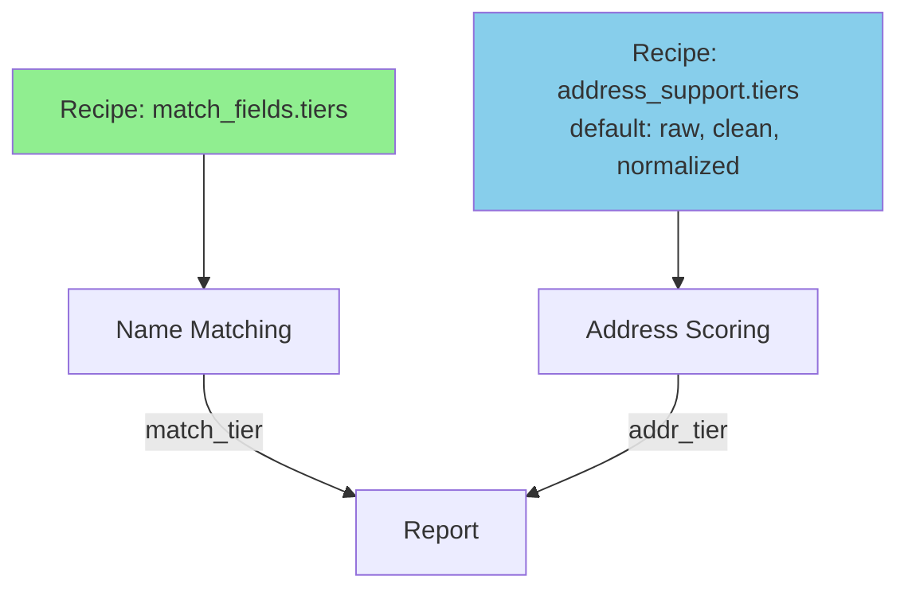
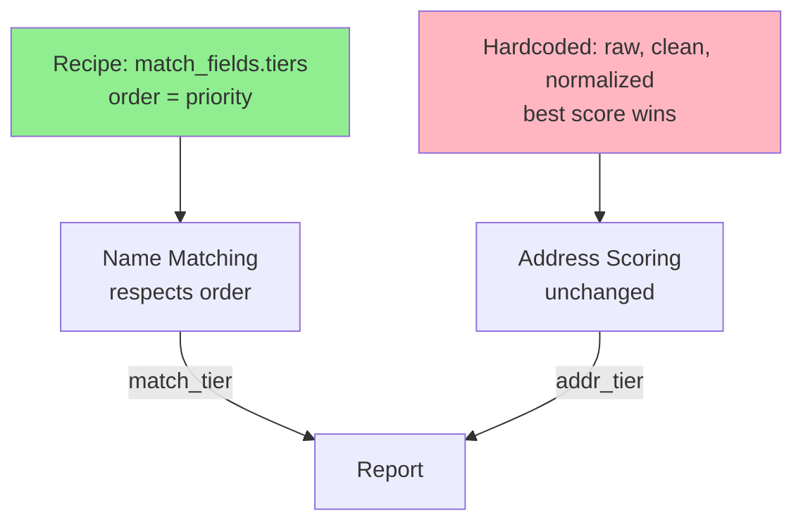

# ADR-002: Tier Configuration Strategy

**Status:** Accepted (Option B)  
**Date:** 2026-04-14  


## Problem

Normalization tiers (raw, clean, normalized) are configured inconsistently between name matching and address scoring:

- **Name matching**: tier list comes from recipe (`match_fields.tiers`), priority is hardcoded (`raw > clean > normalized`)
- **Address scoring**: tier list is hardcoded (`[raw, clean, normalized]`), not configurable from recipe

This creates confusion:
- Setting `tiers: [normalized]` only affects name matching, not address scoring
- Reordering tiers (e.g. `[normalized, raw]`) has no effect on priority
- Report output shows `addr_tier: raw` even when user specified `[normalized]`
- Two columns (`match_tier` and `addr_tier`) use the same vocabulary but are controlled by different systems



## Decision Drivers

1. **Clarity**: user sets tiers in one place, behavior is predictable
2. **Backward compat**: existing recipes produce identical results
3. **Flexibility**: power users can tune tier behavior per step
4. **Simplicity**: don't over-engineer for edge cases
5. **Filter vs signal**: address scoring serves two roles depending on config:
   - **With threshold**: it's a filter (records below threshold are rejected)
   - **Without threshold**: it's a confidence signal (all records pass, score is informational)
   When filtering, the user may want tight control over which tiers produce the score that determines pass/fail. When signaling, all tiers running maximizes the chance of finding the best score. The tier config should support both use cases.

## How Tiers Work Today

Important: tiers apply the **same** normalization to both source and destination. There are no cross-tier comparisons (e.g. clean-source vs raw-dest).

With `tiers: [clean, raw]`, the engine runs:

1. **clean vs clean**: normalize both source and dest with `clean()`, then join/compare
2. **raw vs raw**: use both source and dest as-is, then join/compare
3. Dedup: if the same source record matched in both tiers, keep the preferred one

It does NOT try clean-source vs raw-dest or any mixed combination. Each tier is a complete pass where both sides get the same treatment.

For address scoring, the same applies -- each tier normalizes both source and dest addresses identically before scoring.

## Options

### Option A: Unified Recipe Tiers (Name + Address Share Config)

One `tiers` list per step controls both name matching and address scoring.

```yaml
steps:
  - name: Match Pop1 to core_parent
    match_fields:
      - source: l3_fmly_nm
        destination: Vendor Name
        method: exact
        tiers: [raw, clean]          # controls BOTH name and address tiers
    address_support:
      source: [hq_addr1, hq_addr2]
      destination: [Address1, Address2]
      # no separate tiers -- inherits from match_fields
```

**Priority**: position in list (first = preferred for tie-breaking).



| Pro | Con |
|---|---|
| Simple -- one setting | Name and address may need different tiers |
| Predictable -- what you set is what runs | `[raw, clean]` skips normalized for addresses (loses alias benefit) |
| Easy to document | Less flexible for advanced tuning |

**Migration**: existing recipes with `tiers: [raw, clean]` would stop running normalized for addresses. Address scores could change. Breaking change unless we add a default.

### Option B: Separate Name and Address Tier Config

Add `address_support.tiers` alongside existing `match_fields.tiers`.

```yaml
steps:
  - name: Match Pop1 to core_parent
    match_fields:
      - source: l3_fmly_nm
        destination: Vendor Name
        method: exact
        tiers: [raw, clean]          # name matching tiers
    address_support:
      source: [hq_addr1, hq_addr2]
      destination: [Address1, Address2]
      tiers: [raw, clean, normalized] # address scoring tiers (optional)
```

**Priority**: position in list for both. Address tiers default to `[raw, clean, normalized]` when omitted.



| Pro | Con |
|---|---|
| Full control over each system | Two tier configs to understand |
| Backward compatible (address default unchanged) | More recipe complexity |
| Name and address can be tuned independently | Could confuse new users |

**Migration**: zero impact. Omitting `address_support.tiers` preserves current behavior.

### Option C: Current Behavior + Fix Priority Only

Keep address tiers hardcoded to all-three. Only fix the priority bug (recipe order = preference order).

```yaml
steps:
  - name: Match Pop1 to core_parent
    match_fields:
      - source: l3_fmly_nm
        destination: Vendor Name
        method: exact
        tiers: [clean, raw]          # clean preferred over raw for names
    address_support:
      # no tiers config -- always [raw, clean, normalized]
      # best score wins, first tier breaks ties
```



| Pro | Con |
|---|---|
| Smallest change | Address tiers still not configurable |
| No new config to learn | Doesn't solve the "I set normalized but addr shows raw" confusion |
| Backward compatible | Incomplete fix |

**Migration**: zero impact. Only changes behavior when user explicitly reorders tiers.

## Analysis

| Criterion | Option A | Option B | Option C |
|---|---|---|---|
| Clarity | High (one setting) | Medium (two settings) | Low (partial fix) |
| Backward compat | ⚠️ Breaking | ✅ Safe | ✅ Safe |
| Flexibility | Low | High | Low |
| Implementation effort | Medium | Medium | Low |
| Addresses the confusion? | Yes | Yes | Partially |

## Decision

**Option B -- accepted.** Separate but configurable. It's the only option that:
- Doesn't break existing recipes (address default stays `[raw, clean, normalized]`)
- Gives full control when needed
- Makes the two-system design explicit rather than hiding it
- Position-in-list priority is intuitive (first = preferred)

Document clearly in how-scoring-works.md that name tiers and address tiers are independent systems with independent config.

## Next Steps (if accepted)

1. Fix name tier priority to use recipe order (Issue #92, ~3 lines)
2. Add `address_support.tiers` config with default `[raw, clean, normalized]`
3. Update recipe schema (`config/recipe_schema.json`)
4. Update how-scoring-works.md and l1-recipe.md
5. Add tests for custom tier ordering
