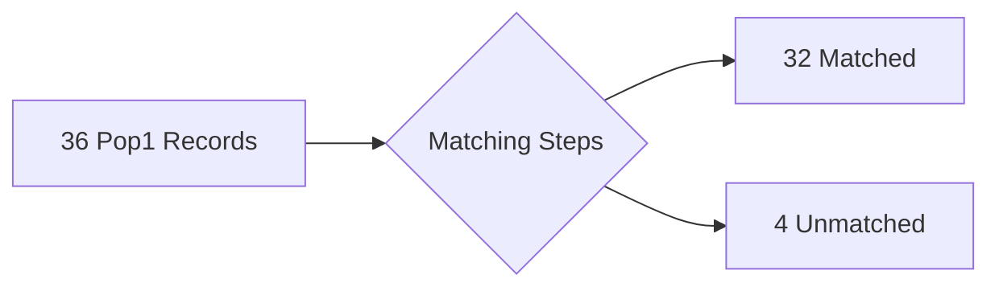
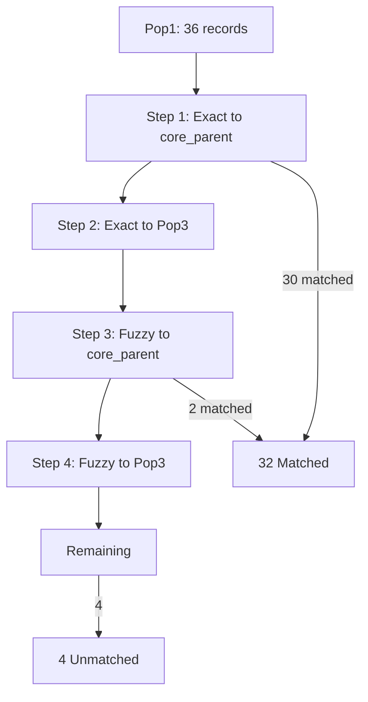
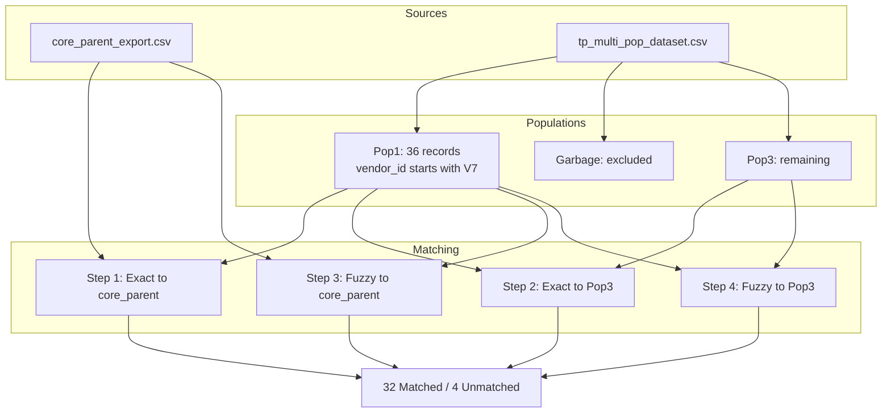
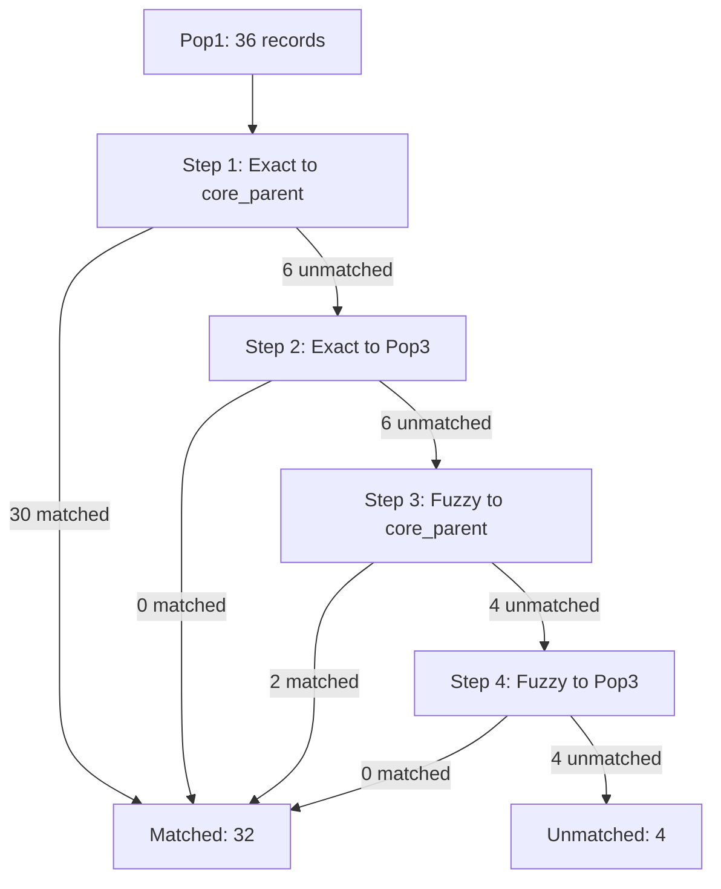
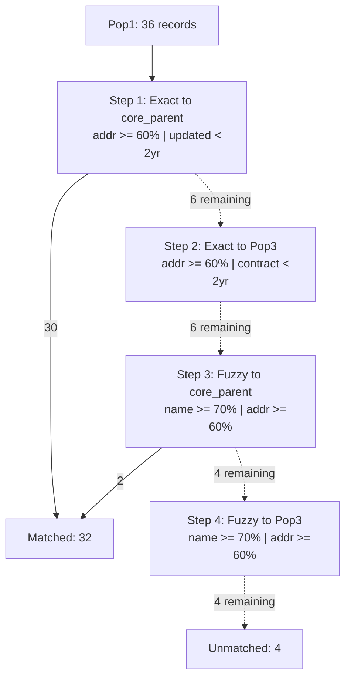
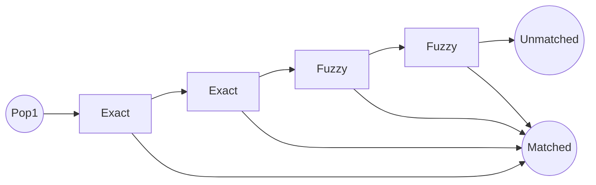

# Mermaid Diagram Samples -- L1 Reconciliation

All of these would be auto-generated from the recipe YAML. Review and tell me which direction works (or what to mix/match).

---

## Option A: Ultra-Simple (just the flow)

The absolute minimum -- data in, steps, data out.

---

## Option B: Steps Visible (linear)

Shows each step as a box in sequence with cascade.

---

## Option C: Sources and Populations

Shows where data comes from before the matching steps.

---

## Option D: Cascade Flow (shows the waterfall)

Emphasizes how records flow through steps -- the cascade behavior.

---

## Option E: Simple with Config Details

Compact but shows key thresholds.

---

## Option F: Bare Bones (almost a legend)

Just shapes and labels, nothing else.

---

## My Take

**Option D** (cascade flow) is the most useful -- it's the one concept people struggle with and it makes it immediately visual. It's also the easiest to auto-generate since it just needs step names and counts.

**Option E** adds the thresholds which ties into the summary table but might be too busy.

**Option B** is a good middle ground if D feels too detailed.

What direction resonates?
